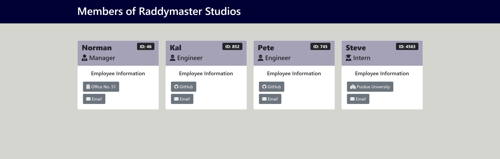

# Team Dashboard Generator

        

      

## Description

A node.js application designed to generate a static HTML page containing team member information for a user. The user will be prompted with a series of questions about their team and a well-formatted HTML page will be created from their responses.

To see an example HTML page [Go Here](./dist/index.html)

See the screenshot below for an visual representation of this file.

## Built With
    

Inquirer

## Table of Contents

* [Installation](#installation)
* [Usage](#usage)
* [Questions](#questions)
* [Additional Thoughts](#additional-thoughts)
* [License](#license)

## Installation
To install the README generator, download or clone the hosting repository. Once downloaded / cloned, navigate to the directory where it is located using the command line. Once in that directory, run "npm install" in the command line. After the "npm install" has finished, run "node index" to start the application. You will be presented with questions about your application. Answer these and at the end you will provided a "Dashboard Generated!" message. The HTML file that is created will be located in the "dist" folder of the application.

## Usage
Please review the installation instructions above for getting started with the application. The video linked below also provides a walkthrough explaining how to get the application up and running as well as how to generate the README.

### How To: Install and Run the Application
[Video Guide](https://youtu.be/EgDjELwK6YU)

### Screenshot

## Questions
If you have questions about this project, please contact me via one of the methods listed below:

Email: andrew@tellitocci.com

GitHub: [antellitocci](https://github.com/antellitocci)

## Additional Thoughts

For future development, we would consider:

* Buffing the input validation to ensure only numbers are inputted for items like employee ID or Office #. Would also like to make sure a proper email address is inputted into the email address question.
* Additional styling to delineate between Manager, Engineer, and Intern.

## License
        
### MIT
        
### Copyright 2021 Andrew Tellitocci
        
Permission is hereby granted, free of charge, to any person obtaining a copy of this software and associated documentation files (the "Software"), to deal in the Software without restriction, including without limitation the rights to use, copy, modify, merge, publish, distribute, sublicense, and/or sell copies of the Software, and to permit persons to whom the Software is furnished to do so, subject to the following conditions:

  The above copyright notice and this permission notice shall be included in all copies or substantial portions of the Software.

  THE SOFTWARE IS PROVIDED "AS IS", WITHOUT WARRANTY OF ANY KIND, EXPRESS OR IMPLIED, INCLUDING BUT NOT LIMITED TO THE WARRANTIES OF MERCHANTABILITY, FITNESS FOR A PARTICULAR PURPOSE AND NONINFRINGEMENT. IN NO EVENT SHALL THE AUTHORS OR COPYRIGHT HOLDERS BE LIABLE FOR ANY CLAIM, DAMAGES OR OTHER LIABILITY, WHETHER IN AN ACTION OF CONTRACT, TORT OR OTHERWISE, ARISING FROM, OUT OF OR IN CONNECTION WITH THE SOFTWARE OR THE USE OR OTHER DEALINGS IN THE SOFTWARE.
      
  