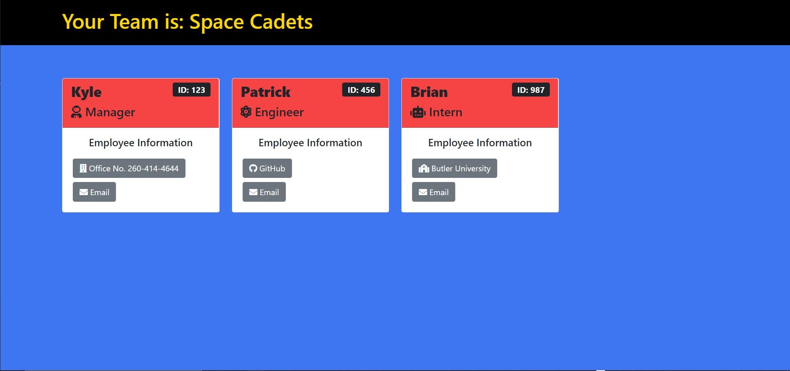

# Team Dashboard Generator

      

## Description

A node.js application designed to generate a static HTML page containing team member information for a user. The user will be prompted with a series of questions about their team and a well-formatted HTML page will be created from their responses.

To see an example HTML page [Go Here](./dist/index.html)

See the screenshot below for an visual representation of this file.

## Built With
    

Inquirer

## Table of Contents

* [Installation](#installation)
* [Usage](#usage)
* [Questions](#questions)

## Installation
To install the Team Profile generator, download or clone the hosting repository. Once downloaded / cloned, navigate to the directory where it is located using the command line. Once in that directory, run "npm install" in the command line. After the "npm install" has finished, run "node index" to start the application. You will be presented with questions about your application. Answer these and at the end you will provided a "Your Dashboard Was Generated!" message. The HTML file that is created will be located in the "dist" folder of the application.

## Usage
Please review the installation instructions above for getting started with the application. The video linked below also provides a walkthrough explaining how to get the application up and running as well as how to generate the README.

### How To: Install and Run the Application
[Video Guide](https://youtu.be/ytTbAkyjbMc)

This video was taken prior to me making major changes to the projects look. The screenshot will differ from how the project looks in the video.

Update video to come! Stay Tuned.

### Screenshot

## Questions
If you have questions about this project, please contact me via one of the methods listed below:

Email: ktodoran@gmail.com

GitHub: [ktodoran](https://github.com/ktodoran)
      
  